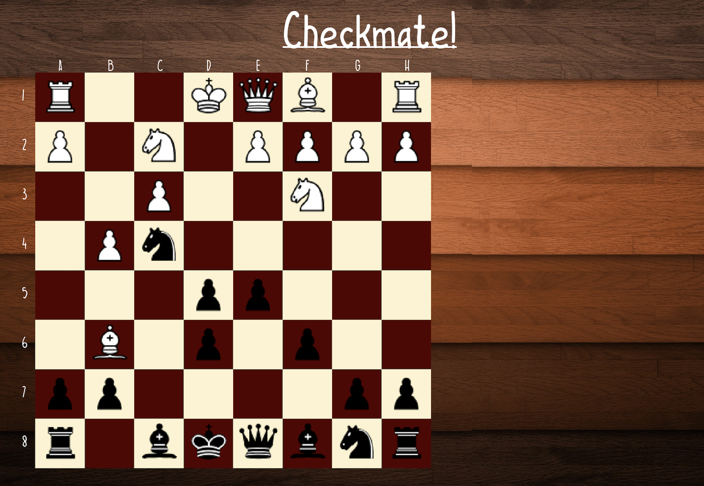

# Checkmate 
Checkmate is an application of the skills I've gained in my introductory computer science courses. The key skills used to complete the project was object-oriented programming, dynamic memory, error handling with exceptions, the map data structure, and artificial intelligence. Specifically, I used polymorphic chess pieces that were stored dynamically on the heap and kept track of them using pointers. The Piece class was an abstract class and included multiple virtual functions. The sub-classes included pawns, rooks, bishops, and the rest of the standard chess pieces. The map class was used to facilitate player movement and CPU movement. The A.I. portion of the game was created using a combination of a heuristic and the minimax algorithm with alpha-beta pruning for efficiency.

# What is does
Checkmate allows for two playing options. First, two human users can play against each other. Secondly, one human player can play against a CPU. 

